# Donation-Hub
Thank you for visiting Donation-Hub, a collaborative project created by 
Julia Bugayev, Angela Thomas, and Kayleigh Young!
## Link to the live project
If you would like to view the Donation-Hub website, follow this link:
* VERCEL URL: https://donation-hub-client.vercel.app 
* HEROKU URL: # https://cryptic-fjord-37790.herokuapp.com/   
* CLIENT GIT: https://github.com/kayleighkat98/donation-hub-client
* SERVER GIT:  https://github.com/jbugayev18/DonationHub-API
## Documentation of the API.
### ROUTES:
* login { POST }
    * '/api/auth/token'
* user { POST }
    * '/api/registration'
* donation-centers { GET, POST }
    * '/api/sites?rect=${box.join(',')} (GET)
    * '/api/sites' (POST)
* items { GET, POST }
    * '/api/items/:site_id (GET)
    * '/api/items/:site_id/items' (POST)
## Summary
In most scenarios, people are willing to donate. However, it is not always clear what organizations
really need or how much of what they are seeking is needed. In order to help strengthen the donation 
process, we decided to create Donation Hub. Donation-Hub exists as a way to centralize the efforts community
champions (donators) need in order to best serve their communities. By using the Donation-Hub website, users 
are able to locate organization near them, browse items that location needs, and give as they please accordingly. 
Users are also able to go in and add donation sites for organizations that may not be as internet accessible.  
## Technology
### REGULAR DEPENDENCIES:
* classnames
* jwt-decode
* react
* react-dom
* react-router-dom
* react-scripts
* @testing-library/jest-dom
* @testing-library/react
* @testing-library/user-event
### DEV DEPENDENCIES:
* cross-env
## Screenshot(s)
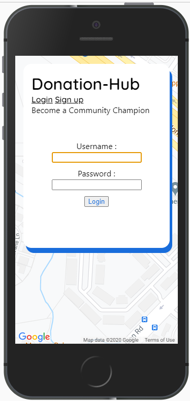
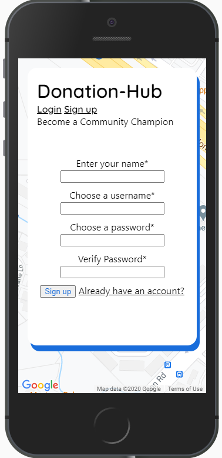
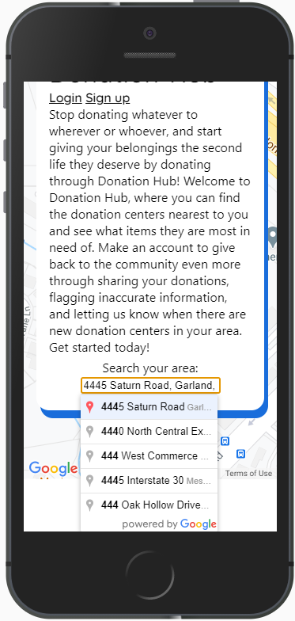
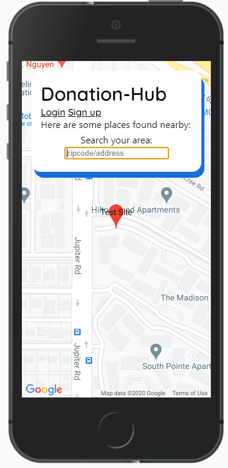
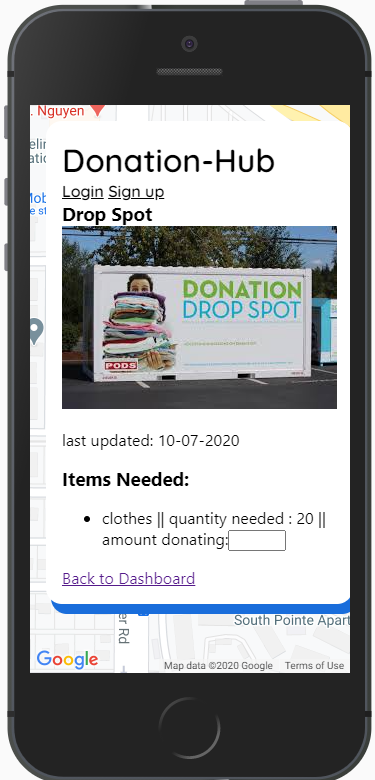
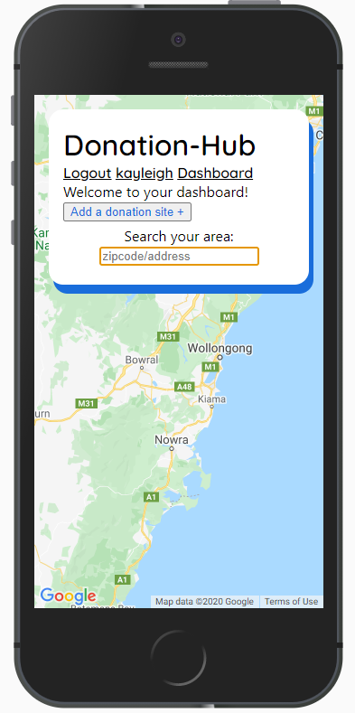
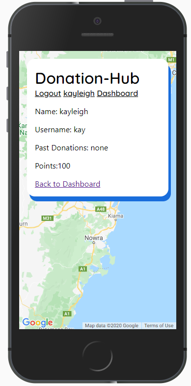
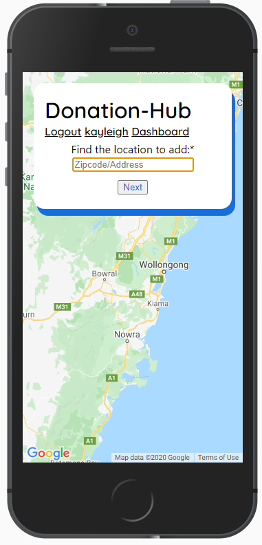
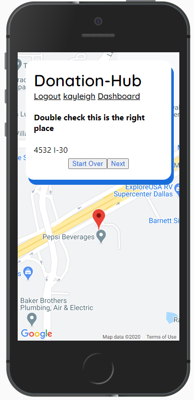
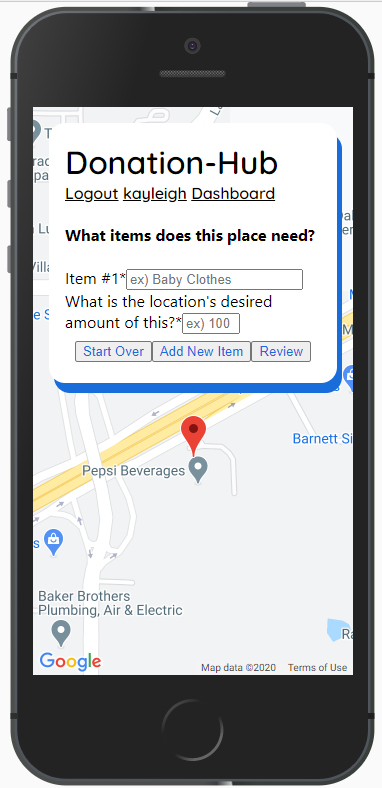
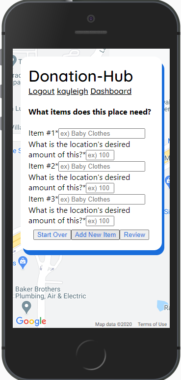
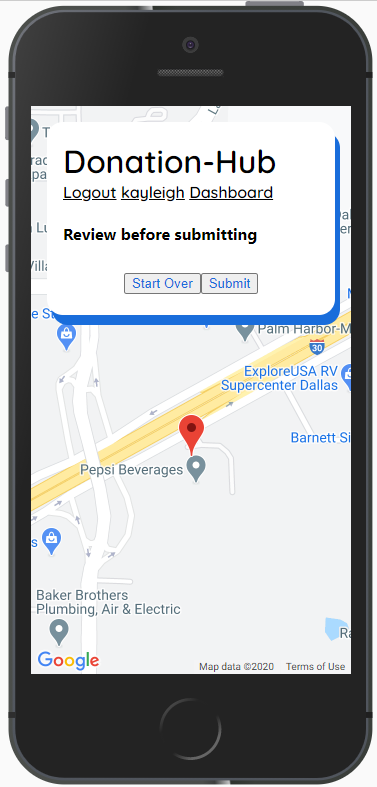
## Contributors:
* ANGELA: https://github.com/
* JOHN: https://github.com/johnadney
* JULIA: https://github.com/jbugayev18
* KAYLEIGH: https://github.com/kayleighkat98
